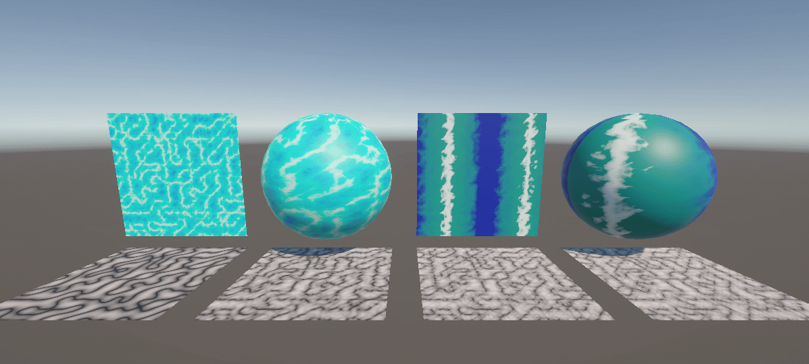
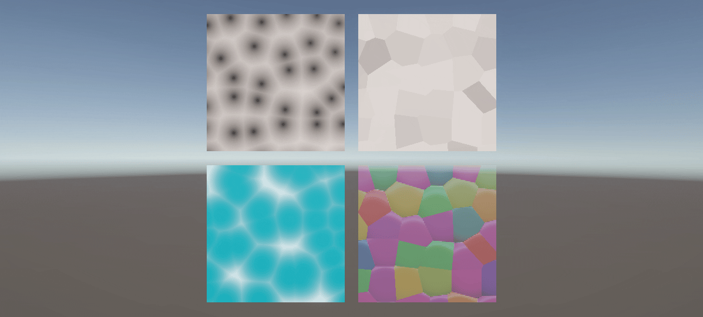
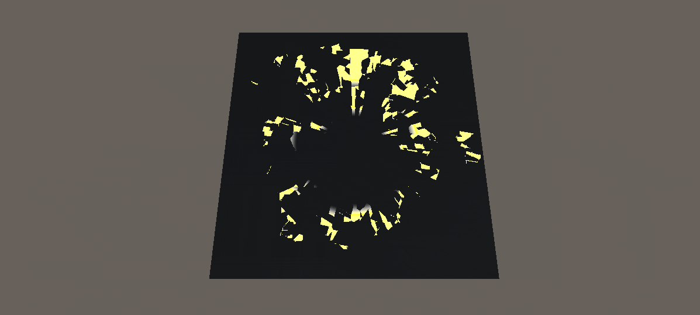

# ノイズ

## はじめに

プログラムワークショップⅣの管理用です

## 結果画像

### ノイズ

### FBM

### パターン

### ボロノイ図

### 炎

### ディゾルブ

### あなたの考えた素敵なシェーダー

-- 工夫した点：
- voronoiを使用して直線をゆがませ、電撃のような形を作りました。
- 中心から外側にかけて放射状に電撃が走るような表現を作りました。

## 進め方

- 本リポジトリ (tpu-game-2025/PGWS4_9_noise)をforkしてください
- fork先のリポジトリを更新してください
- Unityのプロジェクトをsrc内で進めてください
- 結果を画面キャプチャして、画像としてリポジトリに追加して、上記のリンクから見られるようにしてください
- 完成したら本リポジトリのmainブランチにpull requestを投げてください
